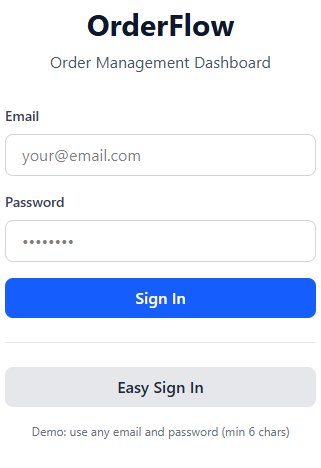
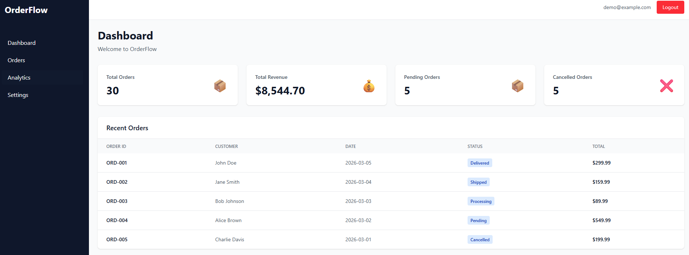
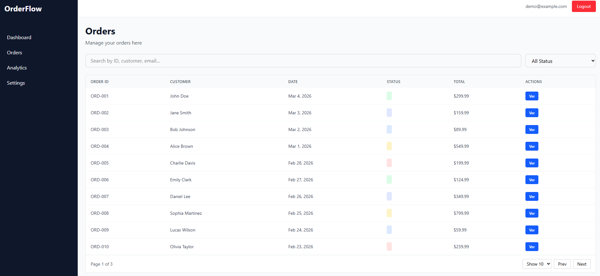
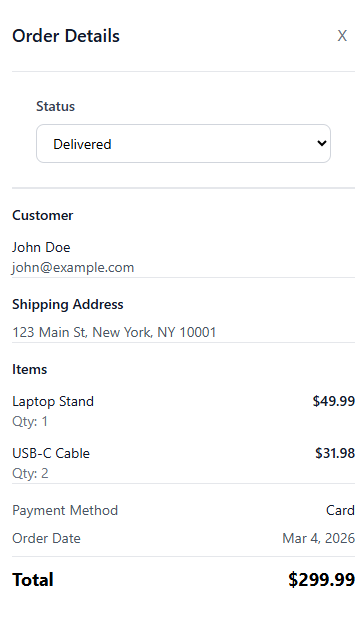
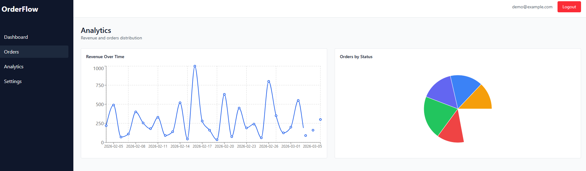
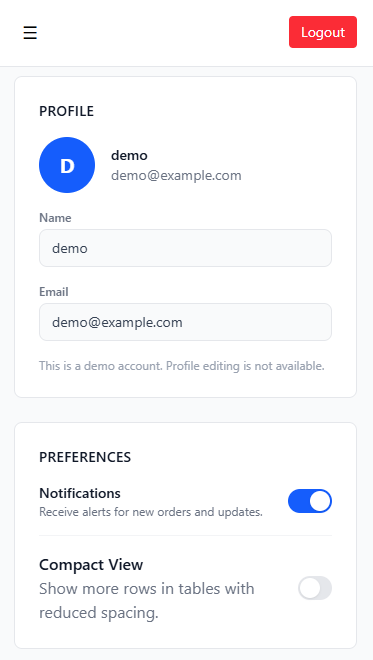

# OrderFlow - Order Management Dashboard

Dashboard administrativo para gestión de pedidos, construido con React, TypeScript y Tailwind CSS.  
Este proyecto está diseñado para demostrar habilidades reales de Front-End en interfaces de negocio: tablas, filtros, métricas, gráficas, estado global y experiencia responsive.

## Live Demo

- App: [https://orderflow-dashboard-sigma.vercel.app/login](https://orderflow-dashboard-sigma.vercel.app/login)
- Repository: [https://github.com/Danielroxs/orderflow-dashboard](https://github.com/Danielroxs/orderflow-dashboard)

## Core Features

- Demo authentication with protected routes
- Private app layout with sidebar + topbar
- Dashboard with KPI cards
- Recent orders section
- Orders table with search, filters, sorting and pagination
- Order detail drawer with status update
- Analytics with revenue and status charts
- Settings page with profile and UI preferences
- Loading and empty states
- Responsive design for desktop, tablet and mobile

## Tech Stack

- React
- TypeScript
- Vite
- Tailwind CSS
- React Router
- Zustand
- TanStack Table
- Recharts

## Project Structure

```txt
src/
  components/
    analytics/
    common/
    dashboard/
    layout/
    orders/
  data/
  pages/
  routes/
  store/
  types/
  utils/
```

## Screenshots

### Login



### Dashboard



### Orders



### Order Detail Drawer



### Analytics



### Settings



## Getting Started

1. Install dependencies

```bash
npm install
```

2. Run development server

```bash
npm run dev
```

3. Build for production

```bash
npm run build
```

4. Preview production build

```bash
npm run preview
```

## Routing Note (Vercel)

This project uses client-side routing with React Router.
Include a vercel.json rewrite config to make direct route reloads work in production.

## Why This Project Matters

OrderFlow is focused on practical Front-End skills used in real admin products:

- Data-heavy UI
- Reusable component architecture
- Global state management
- UX for operational workflows
- Maintainable TypeScript codebase
